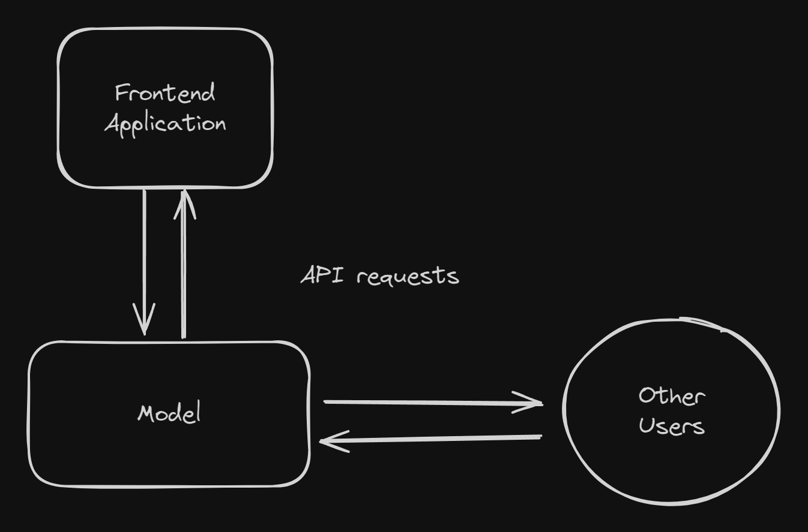

## Setting the stage

Lets say you have collected and processed your data, trained and tested your model and now you have a serialized file containing your model. Now what do you do?

Resist the urge to directly load this into some webapp and directly start running inference on it. This might work fine for demonstrations. There are two main problems with this.
First is the lack of modularity, there are two main parts here first the model itself and second the frontend application that is used for inference. If in the future you want to update the model you would have to update the entire application with it as well.

Second is when further down the line the model is used in scenarios you can't predict. For example, you have a model that summarizes text, this is a very general purpose task which can have lots of applications.

So if you want to serve this model, you want to allow a way for you users to simply send requests with the text to the model and receive the summarized text as the response.

This is where Model As a Service (MaaS) comes in. Here access to the model is in itself the product. For Example, Azure AI Services, Google's Vertex AI etc.
The users will send in an API request to the server running your model and receive a response containing the predictions. And even if you do have a Frontend application, you update each part individually.

That's enough talk for now. So how exactly are we going to achieve this?
We will use a very simple barebones approach onto which further complexity can be added later on.
