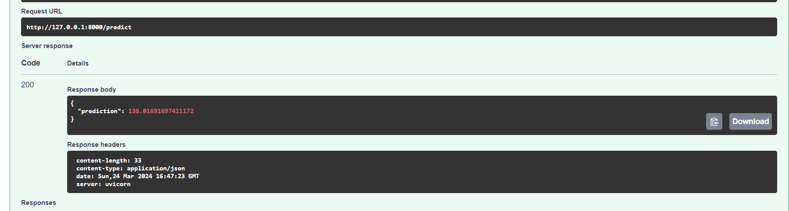

import { Card, CardGrid , LinkCard} from '@astrojs/starlight/components';

### 1. Get the Model Ready

Make sure the model is in a consumable format and has the prediction functions ready. For example, if it is a scikit learn model, the entire preprocessing/prediction pipeline is pickled such that when running inference you just pass in the data and don't have to worry about the various  preprocessing steps. Otherwise you can apply the appropriate steps after loading the raw model.

### 2. FastAPI Server

First lets create a virtual environment, it is recommended you use conda for that but you can use whatever you are comfortable with.

~~~
conda create -n mic-practice python=3.12
~~~

Now lets activate the environment

~~~
conda activate mic-practice
~~~

Next we have to install FastAPI and uvicorn

~~~
pip install fastapi "uvicorn[standard]" pydantic pandas scikit-learn
~~~

Now that FastAPI is installed lets set up our application.

Create a file by the name of "main.py"

~~~python
from fastapi import FastAPI 

app = FastAPI() 

@app.get("/") 

async def read_root(): 
 return {"Hello": "World"}

~~~

Now to run this application go to the terminal and enter

~~~
uvicorn main:app
~~~

and you should be able to access the app at [http://127.0.0.1:8000/](http://127.0.0.1:8000/)

Now time to load the model.

~~~python
from fastapi import FastAPI
import pickle as pk
import pandas as pd
from pydantic import BaseModel
from pathlib import Path

app = FastAPI()

class Request(BaseModel):
    Birth_Rate: float
    Fertility_Rate: float
    Infant_mortality: float
    Maternal_mortality_ratio: float
    Physicians_per_thousand: float

class Response(BaseModel):
    prediction: float

model = pk.load(open(Path(__file__).parent / "model.pickle", "rb"))

@app.post("/predict", response_model=Response)
async def predict(request: Request) -> Response:
    x = pd.DataFrame([request.dict()])
    x.columns = [
        "Birth Rate",
        "Fertility Rate",
        "Infant mortality",
        "Maternal mortality ratio",
        "Physicians per thousand",
    ]
    return Response(prediction=model.predict(x)[0])
~~~

Lets break down the code.

~~~python
from fastapi import FastAPI
import pickle as pk
import pandas as pd
from pydantic import BaseModel
~~~

We first import all the required libraries. Pickle for loading the serialized mode. Pydantic for type validation (we want to make sure that requests and responses correspond to certain data types for example: float).

~~~python
app = FastAPI()
~~~

We create a FastAPI app instance.

~~~python
class Request(BaseModel):
    Birth_Rate: float
    Fertility_Rate: float
    Infant_mortality: float
    Maternal_mortality_ratio: float
    Physicians_per_thousand: float

class Response(BaseModel):
    prediction: float
~~~

Here we create pydantic models describing the Request and Response classes. Basically it means that we can make sure that they correspond to the a specific format.

~~~python
model = pk.load(open(Path(__file__).parent / "model.pickle", "rb"))
~~~

We load the model.

~~~python
@app.post("/predict", response_model=Response)
async def predict(request: Request) -> Response:
    x = pd.DataFrame([request.dict()])
    x.columns = [
        "Birth Rate",
        "Fertility Rate",
        "Infant mortality",
        "Maternal mortality ratio",
        "Physicians per thousand",
    ]
    return Response(prediction=model.predict(x)[0])
~~~

Finally the most important part.
Here <code>@app.post</code> decorator tells the app to execute this function whenever a post request is sent to the <code>/predict</code> endpoint. The function takes a **Request** Object as an input and returns a **Response** Object after passing the response through the model.

Alright we have finally created the FastAPI application. Time to test it.
Go to [http://127.0.0.1:8000/docs](http://127.0.0.1:8000/docs)

Here you can see the API endpoint.
Lets test it!

Trying out with some random values.

There we go we. It works! Well the API atleast not really sure about the model, don't know of a country which has a life expectancy of 138.

Now that we have the FastAPI, time to prevent a very important problem.

<CardGrid>
<LinkCard title="Docker" href="/mics-guide-to-ai-ml/guides/from-the-notebook-to-the-cloud/part-4/"/>
</CardGrid>
