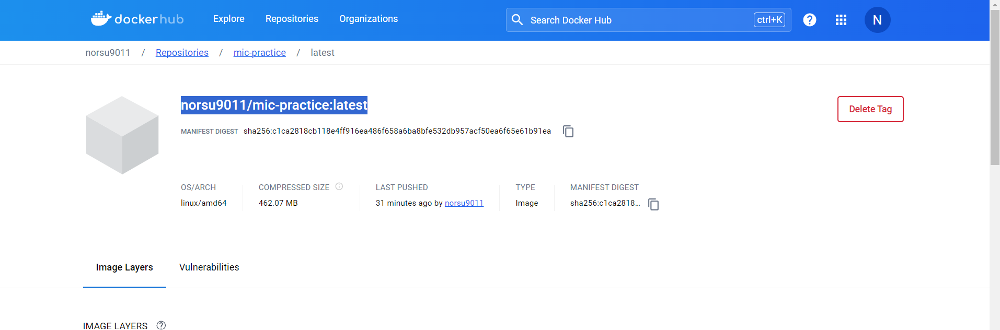
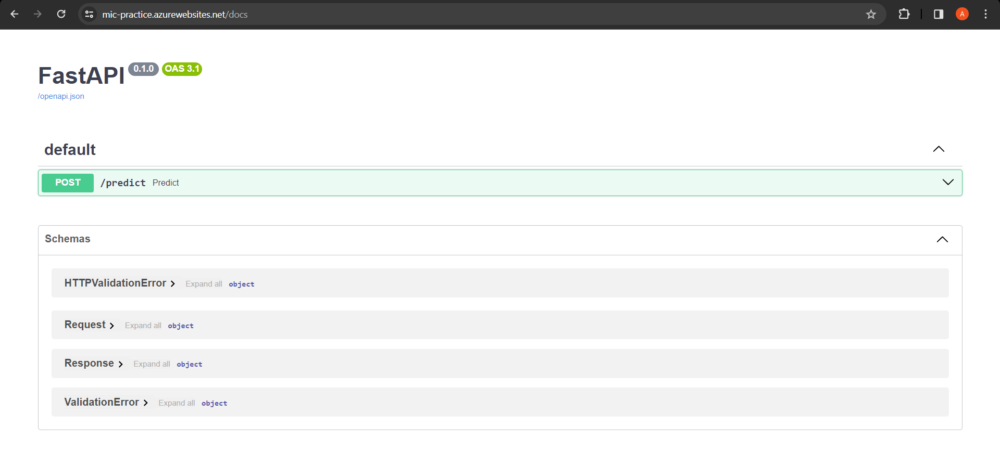

## The Cloud

For this step we could have used any of the the big three AWS/Azure/GCP. On top of that there are several ways of running a container on the cloud. We'll stick with Azure. Mainly because Azure gives 100$ in free credits to students.

As for the service we'll use the easiest method WebApp for Containers.

Let's Begin.

First Login to the Azure Portal.

After logging in click on Create a resource.

Search for Web App for Containers.

Click on Create.

Select a resource group and a name.

Change the Pricing plan to F1 for testing purposes. Later you can use dedicated plans.

Now go to Dockerhub and repository with your image. Copy the tag of the image.

Go to the Docker section and Choose image source as Dockerhub and paste the image tag. After that click on review and create and create your webapp instance.

It will take a minute or so to launch the instance. Once launched go to the service page. Here you will find the Default Domain of the service. Here it is <https://mic-practice.azurewebsites.net/>

You can access the app using this url.

Finally we can test whether the API is working or not using a 3rd party tester from <https://reqbin.com/>
We can see that the /predict endpoint works perfectly.

And with that we have successfully deployed our model as a service onto the cloud. The model inference API can be used by anything that can send and receive HTTP requests.
