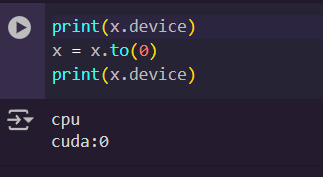

import { Steps } from '@astrojs/starlight/components';


# Overview


## Pytorch

Pytorch is the most popular machine learning framework by a wide margin.
And with good reason as it has much better support then Tensorflow. Even though Tensorflow has better portability, the solutions for Pytorch are actively being worked on.
Basically if you want to do any Machine Learning work in the future you have to learn Pytorch.

Before we begin with the general Overview of the main pillars of Pytorch, lets understand why we actually need Pytorch.
Very simply most of the operations in Deep Learning are parallelizable. Which means they can run much more efficiently on multi-core processors.
A standard consumer grade CPU come with 4-8 cores, compare that to even simple RTX 3050 graphics card that comes with 2560 cores.
However, for writing the code for them requires using CUDA which is quite difficult. This is exactly why Pytorch was developed.
Not only this, Pytorch has several other optimizations specifically for Deep Learning.

## Getting Started

We will cover the fundamentals of Pytorch using a very simple example. The example we will use is the Iris flowers dataset, it is very popular dataset used for learning machine learning. Our task will be to predict the type of flower given its sepal/petal widths and lengths. It is a standard classification problem that is much better suited for classical Tree based algorithms like RandomForest. However, we will use a Neural Network for this task. 

Even though using a Neural Network for this task is overkill, the simplicity of the Iris dataset allows us to focus completely on the Pytorch workflow rather than worrying about the data. Don't worry we will do that in the next part :)

To keep it simple we will use Google Colab. So lets begin!


## Data Loading

Before starting select a GPU runtime. Again we won't actually be needing a GPU for this but we will still use one for demonstration purposes.


Get the Iris dataset from [https://www.kaggle.com/datasets/uciml/iris](https://www.kaggle.com/datasets/uciml/iris) and import it into collab.

Now that we have the data. Lets explore it a little.

```python
import torch
import pandas as pd
data = pd.read_csv("Iris.csv", index_col="Id")
data
```


Alright lets see, there are 5 columns four feature and one target variables.


```python
data['Species'].value_counts()
```


There are three types of flowers setosa, versicolor and virginica and they are same sample sizes.

Just for clarity sakes, lets create a pair plot.

```python
import seaborn as sns

sns.pairplot(hue='Species', data=data, palette='Set1')
```


We can see that the flowers are best differentiated by the Petal width and Length, for Sepal width/length its a little unclear. Anyways EDA is not the point of this tutorial so lets get back to loading the data.

Some of the most confusing parts of Pytorch initially is the way it handles data. 

There are two main abstractions related to data in Pytorch. First we have the Dataset class, it is used to load and perform transformations on the raw data. Second we have the DataLoader Class used to load data into memory.

Lets explore them further.

Often the data we have cannot be directly used to train the model we will need to organize and process it properly such that it is easily accessible. All this can be done using a custom Dataset Class or if your data is already in a standard format you can use the built in utilities for creating the dataset. 

Next we come to the DataLoader. If the data is small enough we can simply pass it as a single batch. However in real world use cases the datasets are much larger and need to be loaded in batches (as we will see in the next part). DataLoaders allow for simple way to split the dataset into batches, shuffle and pass them to the model for training.

Even though for this example both creating a Dataset and DataLoader is unnecessary we will still create them for understanding the Pytorch workflow.

Before we get to that lets learn a little about how data is represented in Pytorch. 

### Tensors


Computers think in numbers. An image in itself holds no meaning to a computer. We will first need to covert it into a format that the computer understands. For this we use tensors.

Tensors are nothing but a generalization of arrays that are optimized for Deep Learning. That's it!
A scalar is a rank-0 tensor.
A vector is a rank-1 tensor.
A matrix is a rank-2 tensor and so on.

Tensors have a shape associated with them. For example if you wanted to represent a 64x64 pixel RGB image you would need a [3, 64, 64] shaped tensor, it simply means there are 3 64x64 matrices, one for each color channel.

A batch of 10 such images could be represented as a [10, 3, 64, 64] tensor and so on.

As you can see using tensors we can represent all kinds of data. In our case the data will be represented as a size [4] tensor one for each feature, for a batch of size 10 it will be [10, 4].

Tensors also have a datatype associated with them, by default it will be float32 also called full precision. 


Tensors can be on the CPU or GPU, this is handled by changing the device attribute. To set the device we can use:

```python
device = "cuda" if torch.cuda.is_available() else "cpu"
```



Lastly and probably the most important is gradient tracking. It is off by default. It tracks the gradients for optimization. We will get back to this later.


:::caution
Don't try to memorize all of this, look up the syntax when needed.
:::
### Dataset and DataLoader

Lets create the Dataset.

```python
from torch.utils.data import Dataset, DataLoader

targets = {"Iris-setosa":0, "Iris-versicolor":1,"Iris-virginica":2}

class CustomDataset(Dataset):

  def __init__(self, data):
    self.features = torch.tensor(data.drop(columns="Species").values, dtype=torch.float)
    self.targets = torch.tensor(data["Species"].map(targets).values, dtype=torch.long)

  def __len__(self):
    return len(self.targets)

  def __getitem__(self, idx):
    return self.features[idx], self.targets[idx]
```

To create a custom Dataset Class you have to override three methods.

```python
def __init__(self, data):
    self.features = torch.tensor(data.drop(columns="Species").values, dtype=torch.float)
    self.targets = torch.tensor(data["Species"].map(targets).values, dtype=torch.long)
```

init for initializing the dataset. You take the raw data as input, it could be anything path to a folder, csv file .etc. In our case it is a pandas dataframe. Next we split the data into features and targets after label encoding the targets and converting both to tensors. 

:::note
We convert the targets to long because it represents a discrete categorical class.
:::

```python
def __len__(self):
    return len(self.targets)
```

This is used for getting the length of the dataset.

```python
def __getitem__(self, idx):
    return self.features[idx], self.targets[idx]
```

Used for returning a single instance from the dataset given an index value.

Now that we have a CustomDataset class. Lets create an instance of the dataset.

```python
dataset = CustomDataset(data)
```

We will need to divide the dataset into a train and test set.

```python
train_set, test_set = torch.utils.data.random_split(dataset, [0.8,0.2])
```

Here we randomly split the data into two sets in the proportion of 0.8 to 0.2 or 80% train and 20% test.

```python
train_loader = DataLoader(train_set, batch_size = 10, shuffle = True)
test_loader = DataLoader(test_set, batch_size = 10, shuffle = True)
```

Next we create two DataLoaders one each for train and test. Here we set the batch size and whether to shuffle the data.

:::note
Batch size is an important Hyperparameter. Choosing the right batch size is essential for achieving good results.
:::

Lets check if the DataLoaders work correctly.

```python
next(iter(train_loader))
```


Nice! we have 10 random examples from the training set, here each row at the top represents one set of input features and the corresponding targets are at the bottom.


## Designing the Model

Every model in Pytorch consists of layers that are combined together to form complex architectures. All these layers are in nn.Module. To create a Neural Network we have to subclass nn.Module and include two methods, init and forward.

```python
import torch.nn as nn

class NeuralNet(nn.Module):

  def __init__(self):
    super().__init__()
    self.layers = nn.Sequential(
        nn.Linear(4,32),
        nn.ReLU(),
        nn.Linear(32,32),
        nn.ReLU(),
        nn.Linear(32,3),
    )
    
  def forward(self, x):
    x = self.layers(x)
    return x
```


In the init method we describe the architecture of out model for instance we are using a simple Neural Network with only one hidden layer. You can see the diagram of the architecture below:


The forward function is used to define how the input travels through the layers. As all the layers are arranged sequentially, we just pass the input through that and return the output.


```python
model = NeuralNet()
model.to(device)
```

```
NeuralNet(
  (layers): Sequential(
    (0): Linear(in_features=4, out_features=32, bias=True)
    (1): ReLU()
    (2): Linear(in_features=32, out_features=32, bias=True)
    (3): ReLU()
    (4): Linear(in_features=32, out_features=3, bias=True)
  )
)
```
Once the model is designed, we create an instance of the model and transfer the model to the GPU.

There are two more things we need to define before training, the loss function and the optimizer.

```python
loss_fn = nn.CrossEntropyLoss()
optimizer = torch.optim.Adam(model.parameters(), lr=0.01)
```

We will use the CrossEntropyLoss to compute our losses. It is well suited for multi-class classification tasks. As for the optimizer we will choose the Adam optimizer and pass the model parameters and learning rate. As for what they do and how they work in the training process we will discuss in the next section.

:::note
Learning rate is another important Hyperparameter. 
:::

## Training

We design the training loop first and the testing loop will be created with just a few modifications. Let's begin!

```python
def train_loop(dataloader, model, loss_fn, optimizer):

  model.train()
  train_loss, correct = 0, 0

  for feat,target in dataloader:
  
    feat, target = feat.to(device), target.to(device)
    optimizer.zero_grad()
    pred = model(feat)
    loss = loss_fn(pred, target)
    loss.backward()
    optimizer.step()
    correct += (pred.argmax(1)==target).type(torch.float).sum().item()
    train_loss += loss

  batch_size = len(dataloader)
  data_size = len(dataloader.dataset)
  accuracy = correct/data_size
  avg_loss = train_loss/batch_size
  
  print(f"train_loss: {avg_loss} || Accuracy: {accuracy}")
```

Alright this is a lot. Let's break it down step by step.

```python
def train_loop(dataloader, model, loss_fn, optimizer):
```

The train loop takes the dataloader, model, loss function and optimizer as inputs, all of which we defined in the previous steps.

```python
  model.train()
```

This is where the gradient tracking from the tensors section comes in. All tensors in the model have their gradients tracked for training. But we don't want to always track them as they waste memory and are not required for inference. `model.train()` simply turns on the gradient tracking for the model parameters (tensors) and also turns on the Dropout and BatchNormalization layers if used. 

Now lets cover the main loop.

```python
for feat,target in dataloader:
  
    feat, target = feat.to(device), target.to(device)
    optimizer.zero_grad()
    pred = model(feat)
    loss = loss_fn(pred, target)
    loss.backward()
    optimizer.step()
    correct += (pred.argmax(1)==target).type(torch.float).sum().item()
    train_loss += loss
```

We extract a single batch of features and corresponding targets from the dataloader. Once extracted they are then moved to the GPU using `.to(device)`.

```python
    optimizer.zero_grad()
    pred = model(feat)
    loss = loss_fn(pred, target)
    loss.backward()
    optimizer.step()
```

This is the main core of the Neural Network training in Pytorch. Well not just Pytorch, this is simply how Neural Networks learn.

<Steps>
1. A batch of input features are passed through the model and stored. (`pred = model(feat)`)
2. The loss is calculated on the outputs generated using the loss function we defined before. (`loss = loss_fn(pred, target)`)
3. The loss is then backpropogated through the network and the gradients are updated. (`loss.backward()`)
4. Based on the gradients the optimizer updates the values of the model parameters. (`optimizer.step()`)
5. There is another step, `optimizer.zero_grad()`, this is used to clean any accumulated gradients from previous steps as Pytorch doesn't do it automatically.
</Steps>

```python
 def train_loop(dataloader, model, loss_fn, optimizer):

  model.train()
  train_loss, correct = 0, 0

  for feat,target in dataloader:
  
    feat, target = feat.to(device), target.to(device)
    optimizer.zero_grad()
    pred = model(feat)
    loss = loss_fn(pred, target)
    loss.backward()
    optimizer.step()
    correct += (pred.argmax(1)==target).type(torch.float).sum().item()
    train_loss += loss

  batch_size = len(dataloader)
  data_size = len(dataloader.dataset)
  accuracy = correct/data_size
  avg_loss = train_loss/batch_size
  
  print(f"train_loss: {avg_loss} || Accuracy: {accuracy}")
```

Rest of the code is just used to calculate metrics like Accuracy and average loss over epoch.
`correct += (pred.argmax(1)==target).type(torch.float).sum().item()` is used to calculate total number of correct predictions. It uses argmax to find prediction with maximum probability along the axis=1, which means it outputs an array with argmax of each instance in the batch. It is then compared with the true target values and the result is a boolean array which is then converted to a numerical form (True=1, False=0). Its then all summed and converted to normal python int format to find total number of correct predictions in a batch.

The rest is self explanatory.

The test loop is nearly the same except some key differences.

```python
def test_loop(dataloader, model, loss_fn):

  model.eval()
  test_loss, correct = 0, 0

  with torch.no_grad():

    for feat, target in dataloader:

      feat, target = feat.to(device), target.to(device)
      pred = model(feat)
      loss = loss_fn(pred, target)
      correct += (pred.argmax(1)==target).type(torch.float).sum().item()
      test_loss += loss
      
  batch_size = len(dataloader)
  data_size = len(dataloader.dataset)
  accuracy = correct/data_size
  avg_loss = test_loss/batch_size
  
  print(f"test_loss: {avg_loss} || Accuracy: {accuracy}")
```

Instead of using `model.train()` we use `model.eval()` which does effectively the opposite, turns of gradient tracking and Dropout and BatchNormalization layers. It is unnecessary because we use `torch.no_grad()` later, but we can use either. 

The rest is exactly the same.

After all this Setup its finally time to train our model.

```python
num_epochs = 10
for epoch in range(num_epochs):
  print(f"\nEpoch: {epoch+1}:")
  train_loop(train_loader, model, loss_fn, optimizer)
  test_loop(test_loader, model, loss_fn)
```

The Result:


ok not bad! It reaches practically 95%+ accuracy pretty quickly. Again complete overkill for a task which is much better suited for classical algorithms. But still we got to see how to train a Neural Network on tabular data for classification.

Even though this is a simple task, we will use the same basic structure and expand on it for solving more complex problems in the future. 

In the next tutorial we will see how to perform Image Classification on over 5400+ images of over 90 animals. Covering CNN's and Transfer learning. Finally putting those GPU's to use.

---