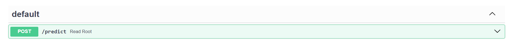
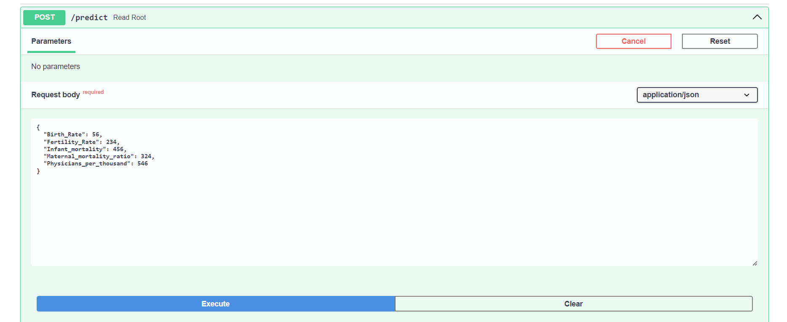
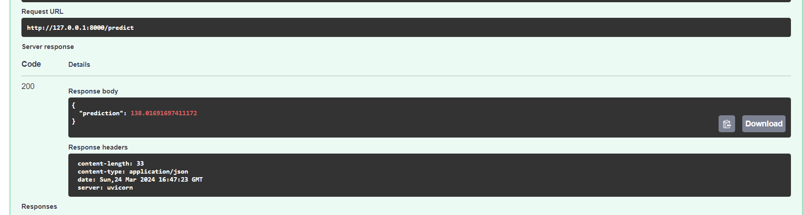
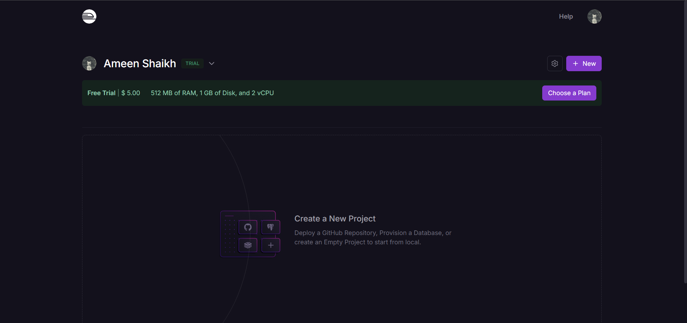
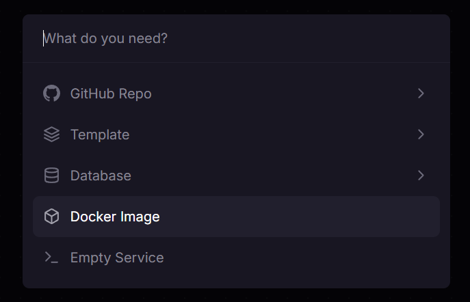
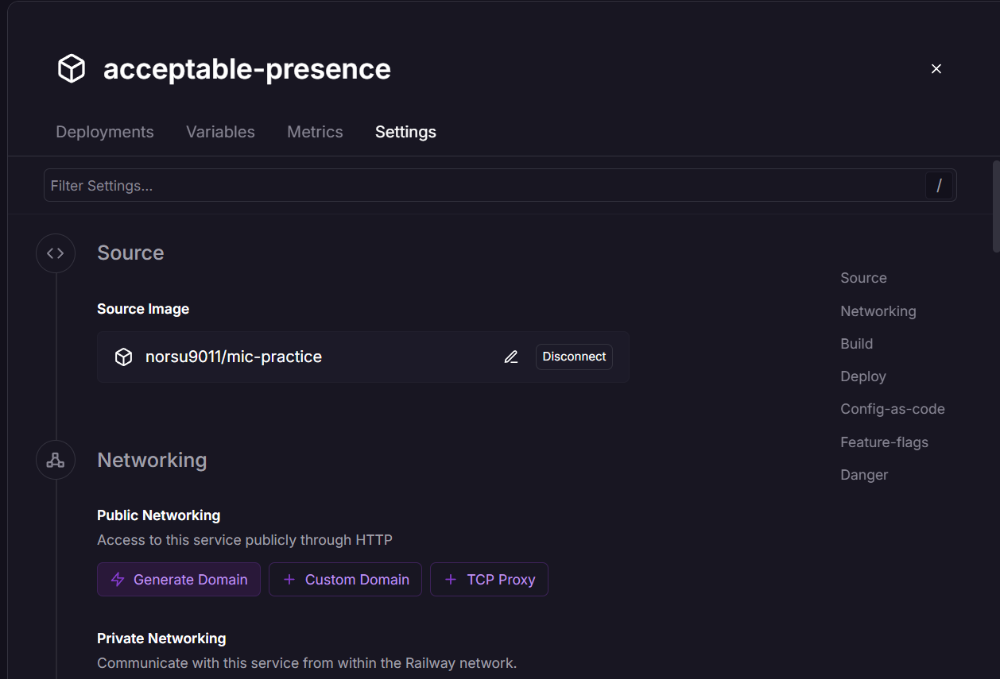
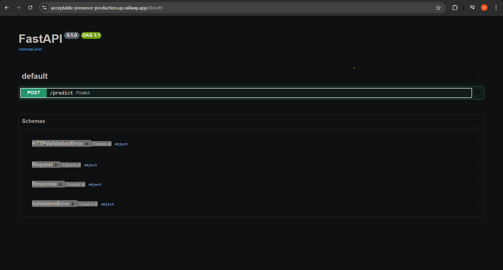

This is the second version of the guide. Last time, we used Azure to deploy our model. For this version, we'll use a service called [Railway](https://railway.app/). Most of the code and explanations are the same as the last version, except for a few changes.

## But why tho?

If it’s not already obvious, machine learning work isn’t done in isolation. Unless you’re engaged in cutting-edge research with resources from Big Tech or academia, practical application of your solution is still essential.

As an individual ML practitioner, your job doesn’t end with training and evaluating models; you should also know how to apply them in the real world.

This guide isn’t about covering the full intricacies of Machine Learning Systems and Lifecycles. Instead, it takes small steps to introduce some of the technologies involved.

## We’ll Cover:

1. Building a FastAPI application for your model.
2. Containerizing your FastAPI application.
3. Deploying your application to a cloud platform.

### 1. Get the Model Ready

Make sure the model is in a consumable format with prediction functions ready. For example, if it’s a scikit-learn model, the entire preprocessing/prediction pipeline should be pickled, so that during inference, you only need to pass in data without worrying about preprocessing steps.

### 2. FastAPI Server

First, create a virtual environment. It’s recommended to use conda, but feel free to use any tool you’re comfortable with.

```bash
conda create -n mic-practice python=3.12
```

Now, activate the environment:

```bash
conda activate mic-practice
```

Next, install FastAPI and Uvicorn:

```bash
pip install fastapi "uvicorn[standard]" pydantic pandas scikit-learn
```

Now that FastAPI is installed, set up your application.

Create a file called `main.py`:

```python
from fastapi import FastAPI 

app = FastAPI() 

@app.get("/") 
async def read_root(): 
    return {"Hello": "World"}
```

To run this application, open the terminal and enter:

```bash
uvicorn main:app
```

You should be able to access the app at [http://127.0.0.1:8000/](http://127.0.0.1:8000/).

Now, load the model:

```python
from fastapi import FastAPI
import pickle as pk
import pandas as pd
from pydantic import BaseModel
from pathlib import Path

app = FastAPI()

class Request(BaseModel):
    Birth_Rate: float
    Fertility_Rate: float
    Infant_mortality: float
    Maternal_mortality_ratio: float
    Physicians_per_thousand: float

class Response(BaseModel):
    prediction: float

model = pk.load(open(Path(__file__).parent / "model.pickle", "rb"))

@app.post("/predict", response_model=Response)
async def predict(request: Request) -> Response:
    x = pd.DataFrame([request.dict()])
    x.columns = [
        "Birth Rate",
        "Fertility Rate",
        "Infant mortality",
        "Maternal mortality ratio",
        "Physicians per thousand",
    ]
    return Response(prediction=model.predict(x)[0])
```

#### Code Breakdown

1. **Imports**: We import the required libraries—`pickle` for loading the serialized model and `Pydantic` for type validation to ensure requests and responses match expected data types.

2. **App Instance**: We create a FastAPI app instance.

3. **Request and Response Models**: Using Pydantic models, we define the format of request and response data.

4. **Load Model**: The model is loaded using `pickle`.

5. **Prediction Endpoint**: The `@app.post` decorator sets up a POST endpoint at `/predict`. The function takes a **Request** object as input and returns a **Response** object after making a prediction.

Finally, we’ve created the FastAPI application! Time to test it. Go to [http://127.0.0.1:8000/docs](http://127.0.0.1:8000/docs) to see the API endpoint.



Here, you can see the API endpoint. Let’s test it!



Trying out with some random values.



And there we go—it works! At least, the API does; we’ll assume the model is also performing correctly :|

---

### 3. Docker

If nothing else, this guide should give you a solid understanding of Docker. Docker helps prevent dependency issues and ensures consistent environments across different setups.

Install Docker here: [https://docs.docker.com/get-docker](https://docs.docker.com/get-docker). Once installed, run the Docker daemon.

1. **Create Directory Structure**: In your project directory, create an `app` folder and put `main.py` and `model.pickle` in it. Add an empty `__init__.py` file in the same directory. Create `requirements.txt` by running:

   ```bash
   pip freeze > requirements.txt
   ```

2. **Create Dockerfile**: In the main project directory, create a file called `Dockerfile` with the following content:

   ```Dockerfile
   FROM python:3.12.2-slim

   WORKDIR /code

   COPY ./requirements.txt /code/requirements.txt 

   RUN pip install --no-cache-dir --upgrade -r /code/requirements.txt

   COPY ./app /code/app

   EXPOSE 80

   CMD ["uvicorn", "app.main:app", "--host", "0.0.0.0", "--port", "80"]
   ```

   - This Dockerfile configures the build by pulling a base Python image, setting up the working directory, and copying dependencies and application code.

3. **Build Docker Image**: Run the following command to build the image:

   ```bash
   docker build -t mic-practice .
   ```

4. **Run Docker Container**: To run the container, use:

   ```bash
   docker run -d --name test -p 80:80 mic-practice   
   ```

You should be able to access the app at [http://127.0.0.1:80](http://127.0.0.1:80).

5. **Upload to DockerHub**: To access the image from anywhere, upload it to DockerHub. First, tag the image:

   ```bash
   docker tag mic-practice norsu9011/mic-practice
   ```

   Then log in and push the image:

   ```bash
   docker login
   docker push norsu9011/mic-practice
   ```

Docker provides consistent environments for development and deployment, avoiding "works on my machine" issues.


---

### 4. Deploying to Railway

1. **Sign Up on Railway**: Go to [Railway](https://railway.app/) and create an account.

2. **Create Project**: After signing in, create an empty project, then choose "Deploy a Docker Image."

   

3. **Deploy Docker Image**: Enter the image tag from DockerHub and click on deploy.

   

4. **Get Public Domain**: Once deployed, open settings, click on the generated domain, and you’ll get a publicly accessible API.

   



This guide provides a simple look at deploying machine learning models. It’s not exhaustive but should help you get started with productionizing models. Thanks for following along, and happy deploying!

